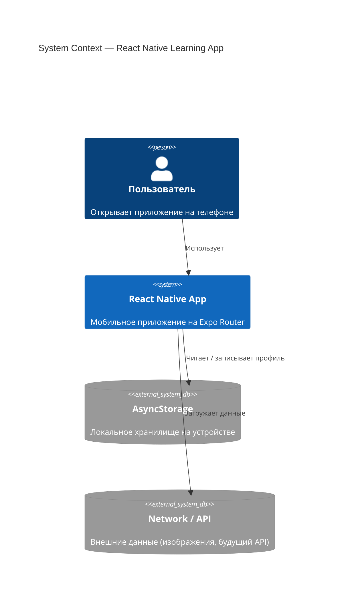
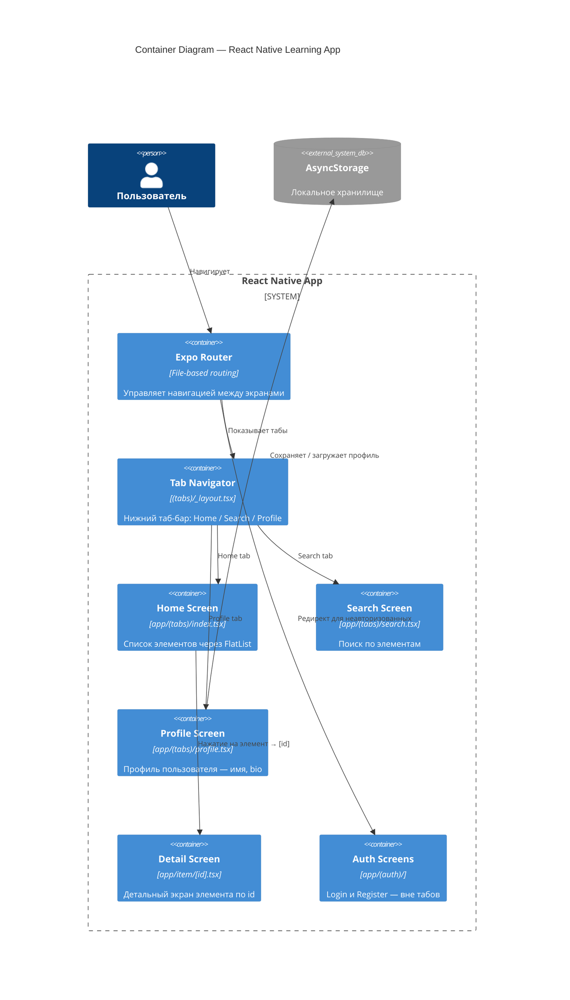
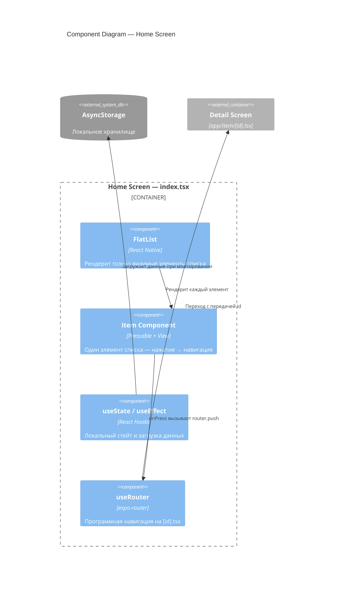

# C4 Architecture Diagrams

C4 — четыре уровня детализации архитектуры: Context → Container → Component → Code.

---

## Level 1 — System Context
> Кто использует систему и с чем она взаимодействует.



---

## Level 2 — Container
> Из каких крупных частей состоит приложение.



---

## Level 3 — Component (Home Screen)
> Из чего состоит конкретный экран.



---

## Планируемая структура файлов (Block 2)

```
app/
├── _layout.tsx              # Root layout (Stack)
├── (tabs)/
│   ├── _layout.tsx          # Tab navigator
│   ├── index.tsx            # Home — FlatList со списком
│   ├── search.tsx           # Search
│   └── profile.tsx          # Profile (перенесём сюда логику из index)
├── item/
│   └── [id].tsx             # Детальный экран
└── (auth)/
    ├── login.tsx
    └── register.tsx
```
